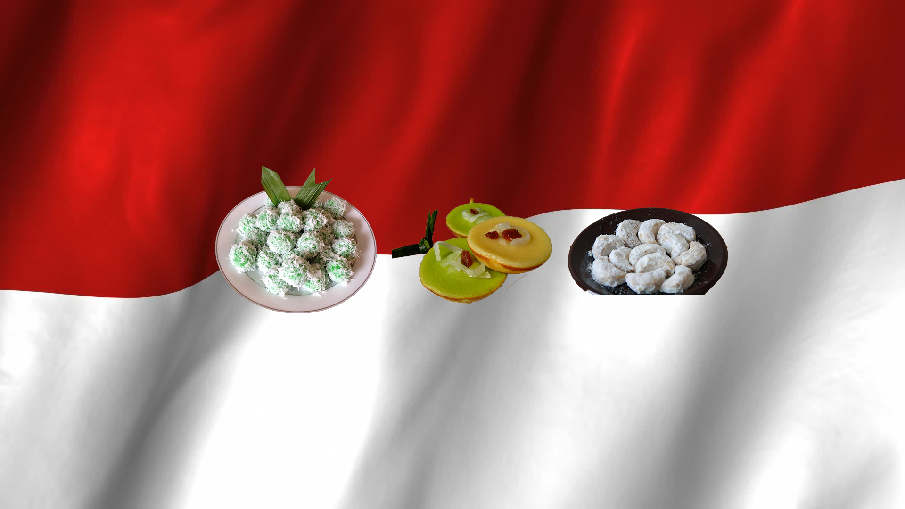
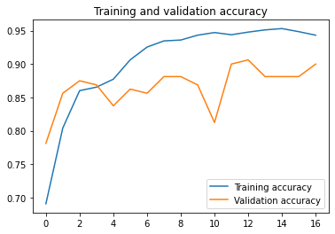

# Image Classifcation Kue Indonesia
<p align="center">  </p>   
  
This repository contain our <a href="https://events.withgoogle.com/bangkit/">Bangk!t</a> final group assignment.  

Member:  
* [Annisa Sekar Ayuningtyas](https://github.com/annisasekaar)
* [Ilham Firdausi Putra](https://github.com/ilhamfp)
  
In this repo, we implement an Indonesian Tradicional Cake Classifier. Why? Why not. With TensorFlow as our main framework, we run various experiment from simple CNN, to transfer learning using VGG, Inception, and EfficientNet.

## Datasets
[The full dataset is available here](https://www.kaggle.com/ilhamfp31/kue-indonesia). The dataset contain images of various traditional cake from Indonesia. More specifically:

* Kue Klepon
* Kue Lumpur
* Kue Kastengel
* Kue Putri Salju
* Kue Serabi
* Kue Dadar Gulung
* Kue Lapis
* Kue Risoles

"Kue" means cake in Indonesia.

## Collection Methodology
The dataset was collected from Bing image searches crawled using https://github.com/ultralytics/google-images-download

## Experiment
We run various experiment from simple CNN, to transfer learning using VGG, Inception, and EfficientNet. Taking into consideration the performance of the model and the amount of parameter it has, our best model is EfficientNetB3.

<p align="center">  </p>  
<p align="center">  </p>  

Using the best model based on validation performance, we predict the test set. Final result:
```
loss: 0.2632 - accuracy: 0.9187
```

